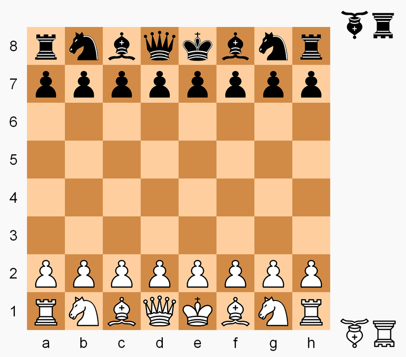

# CS 162 - Variant Chess Portfolio Project

Moves are not inputted at runtime but are written and ran with the program, as follows below:
```
game = ChessVar()
move_result = game.make_move('c2', 'c4')
game.make_move('g7', 'g5')
state = game.get_game_state()
```
Locations on the board are specified using "algebraic notation", with columns labeled a-h and rows labeled 1-8, as shown in this diagram:



Special rules for this variant of chess:
**there is no check or checkmate, and there is no castling, en passant, or pawn promotion**. 
If a player's king is captured, the game ends, and that player loses. 

Each of the players in the reserve has one piece of the **Falcon** and the **Hunter**.

Falcon: moves forward like a bishop, and backward like a rook

Hunter: moves forward like a rook and backward like a bishop

The falcon and hunter start the game off the board and out of play (see diagram). Once a player loses their queen, a rook, a bishop, or a knight, they may, on any subsequent move, enter their falcon or hunter into play on any **empty square of their two home ranks**. Doing so constitutes a turn. The player becomes eligible to enter their remaining fairy piece (falcon or hunter) after losing a second piece (queen, rook, bishop, or knight)(could be anytime after losing the first piece, don’t need to be losing after entering the first fairy piece). https://www.chess.com/blog/Pokshtya/falcon-hunter-chess
https://en.wikipedia.org/wiki/Falcon%E2%80%93hunter_chess

